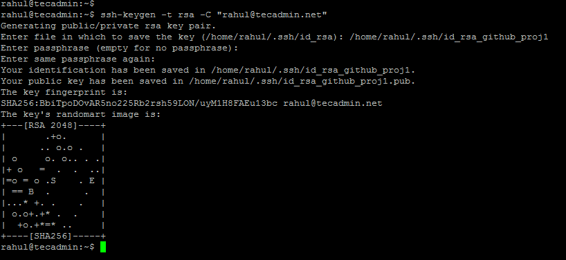

# Step 1 – Generate New SSH keys

First of all, check for all the available SSH keys in your account. Type: ls -l ~/.ssh to list all key pairs, So you won’t overwrite any key with below commands.

Let’s create first key pair by typing below command.

```
ssh-keygen -t rsa -C "your-email" 
```

+ Execute above command with your email address.
+ Set a new file path to prevent override existing file as: /home/rahul/.ssh/id_rsa_github_proj1
+ Press enter for passphrase and confirm passphrase to keep it empty
+ Your key is ready.



The above command will create two file under ~/.ssh directory. Once is private key and one is public key.

+ Private key: ~/.ssh/id_rsa_github_proj1 (Never share this file with anyone)
+ Public key: ~/.ssh/id_rsa_github_proj1.pub (Upload this file to your Git account)

Use the above command to create more SSH key pairs. Just remember to change the filename to prevent overwrite of file.


# Step 2 – Attach SSH keys to Git Accounts

Now add the SSHs key to the corresponding GitHub, Gitlab, AWS Codecommit and other Git accounts. Copy the **.pub** file content and upload to Git accounts.

## Github
+ 1: In the upper-right corner of any page, click your profile photo, then click Settings.

+ 2: In the user settings sidebar, click SSH and GPG keys.

+ 3: Click New SSH key or Add SSH key.

+ 4: In the “Title” field, add a descriptive label for the new key. For example, if you’re using a personal Mac, you might call this key “Personal MacBook Air”.
+ 5: Paste your key into the “Key” field.

+ 6: Click Add SSH key.

# Step 3 – Create Git Config File
Next, create a ssh configuration file for your user account. By default the user ssh configuration file exist under the .ssh directory in your home directory. Create and edit configuration file with the following file:
```
nano ~/.ssh/config 
```

Append below entries to this file.

```
Host github-proj1
  HostName github.com
  User git
  IdentityFile ~/.ssh/id_rsa_github_proj1
 
Host github-proj2
  HostName github.com
  User git
  IdentityFile ~/.ssh/id_rsa_github_proj2
 
```
Save your file and close it. You have done with the required configuration of using multiple git accounts on a system.

# Step 4 – Let’s Start Your Work

Your system is ready to use the multiple remote repositories from multiple accounts. You can connect your existing code with remote repository and push updates. For the new project, simply clone the repository on your machine and start your work.

You need to change host in git url as defined in ~/.ssh/config file. See the below examples:

##  For a New Repository
### Repository from first Github account:
```
git clone ssh://github-proj1/user1/repo.git 
```
### Repository from second Github account:

```
git clone ssh://github-proj2/user2/repo.git 
```

## For an existing codebase
For the existing codebase, your can use the following commands to connect your code with remote repository. Then add and commit files to the repository.

```
cd my-code 
git init 
git remote add ssh://github-proj2/user2/repo.git 
git add . 
git commit -m "Initial commit" 
git push origin master 
```

# References:
https://tecadmin.net/setup-multiple-github-accounts-on-linux/